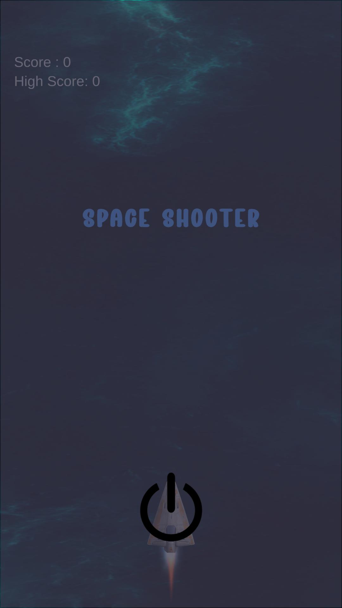
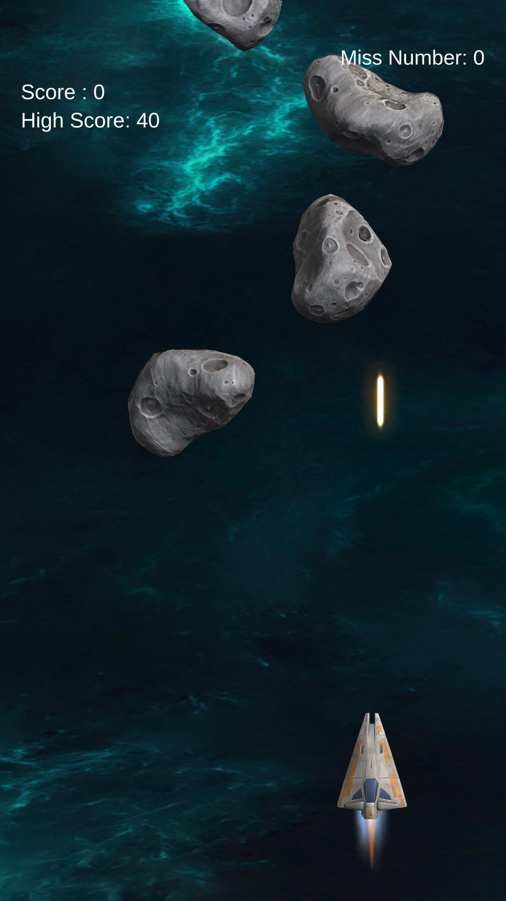
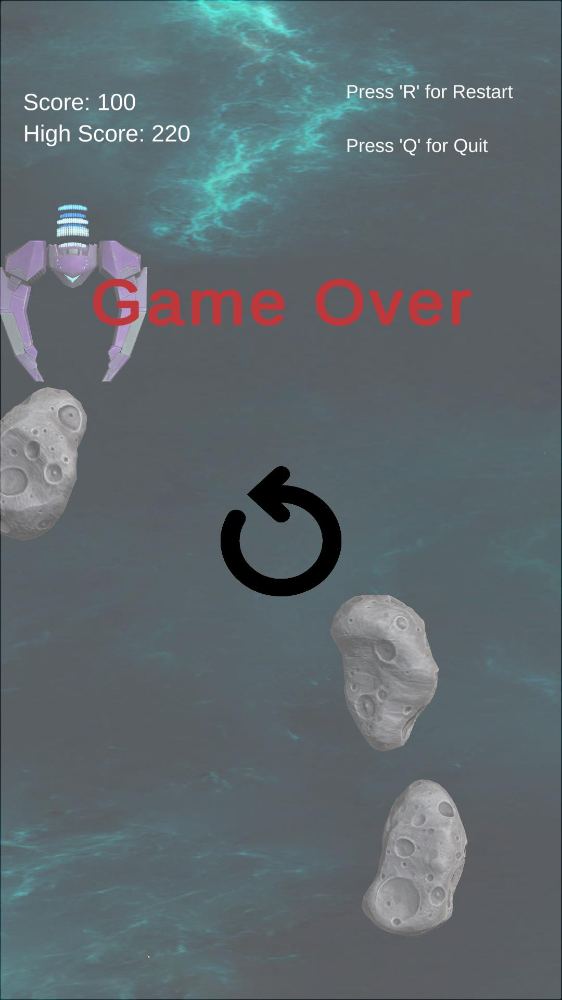
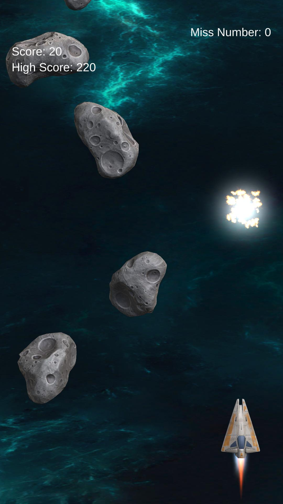
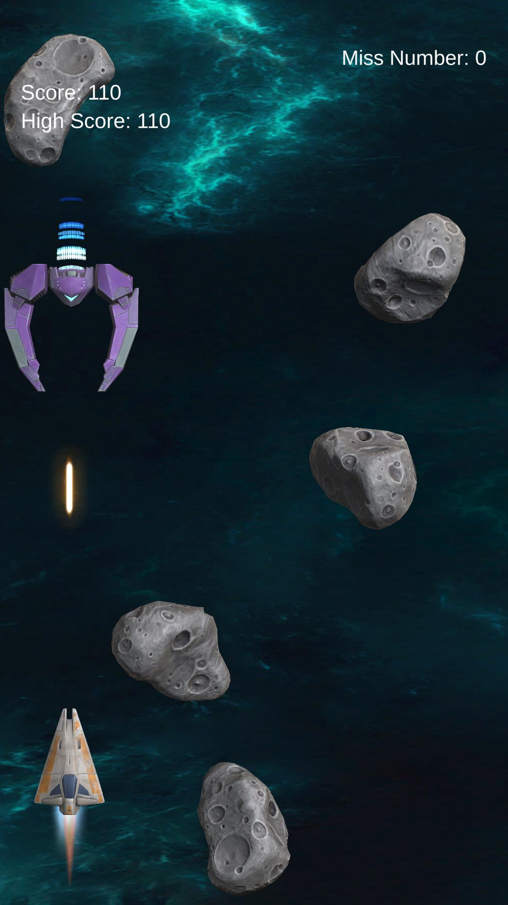
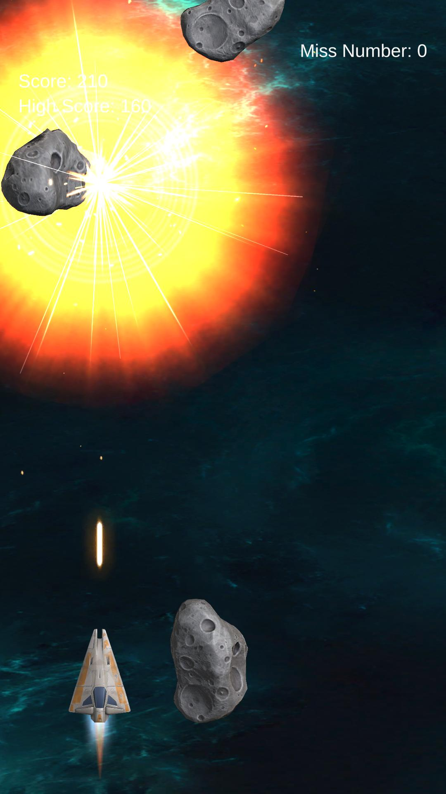

<h1 align="center"> Space Shooter </h1>
 

    

 

## Introduction

This project is a Space shooter Game Clone developed using Unity. The main objective of the game is to shoot as many asteroids as possible and earn points. The player can earn extra points if he cuts the boss.

  

   
   

## Features

&nbsp;&nbsp;&nbsp; 🎮 Player-Controlled Spacecraft – Control your spaceship using a keyboard or gamepad.

&nbsp;&nbsp;&nbsp; ☄️ Increasingly Challenging Asteroid Waves – Asteroids become faster and smaller with each wave.

&nbsp;&nbsp;&nbsp; 💯 Scoring System – Earn +10 points for each destroyed asteroid and +200 points for defeating the boss.

&nbsp;&nbsp;&nbsp; 👾 Boss Battle – Face a special boss enemy in wave 7.

&nbsp;&nbsp;&nbsp; 🔥 Effects and Animations – Includes explosions, lighting effects, and dynamic animations.

&nbsp;&nbsp;&nbsp; 🎶 Sound Effects and Music – Features immersive sound effects and background music.

&nbsp;&nbsp;&nbsp; 🛠️ Unity Physics Engine – Uses Unity's physics system for realistic asteroid movement and collisions.

&nbsp;&nbsp;&nbsp; 🔄 Endless Wave System – Each wave gets harder, challenging you to achieve a higher score.

## How to Play?

&nbsp;&nbsp;&nbsp; 1.Move Your Spaceship – Use the arrow keys (⬅️➡️) or A/D keys to move left and right.

&nbsp;&nbsp;&nbsp; 2.Shoot Asteroids – Click the left mouse button to fire and destroy incoming asteroids.

&nbsp;&nbsp;&nbsp; 3.Earn Points – Each asteroid destroyed gives +10 points, and defeating the boss grants +200 points.

&nbsp;&nbsp;&nbsp; 4.Survive the Waves – Each wave gets harder as asteroids become faster and smaller.

&nbsp;&nbsp;&nbsp; 5.Defeat the Boss – On wave 7, a powerful boss enemy will appear—destroy it to earn bonus points!

&nbsp;&nbsp;&nbsp; 6.Avoid Collisions – If an asteroid hits your spaceship, you lose a life. Stay alert!

## Development Progress

&nbsp;&nbsp;&nbsp; -Player-controlled spaceship

&nbsp;&nbsp;&nbsp; -Asteroid waves and scoring system

&nbsp;&nbsp;&nbsp; -Boss battle on wave 7

&nbsp;&nbsp;&nbsp; -New power-ups and weapons (Planned)

&nbsp;&nbsp;&nbsp; -Different enemy types (Planned)

### Technologies Used

&nbsp;&nbsp;&nbsp; 1.Unity Engine: Primary development environment for the game.

&nbsp;&nbsp;&nbsp; 2.State Machine: Used to manage game states.

&nbsp;&nbsp;&nbsp; 3.DOTween: Simplifies animations and enhances visual effects.

<h2 align="center">Screenshots</h2>

<table align="center">
  <tr>
    <td align="center">
      
InGame Menu-Asteroid Wave

      
    </td>
    <td align="center">
      
InGame Menu-Asteroid Explosion

      
    </td>
    <tr>
    <td align="center">
      
InGame Menu-Boss

      
    </td>
    <td align="center">
      
InGame Menu-Boss Explosion

      
    </td>
  </tr>
</table>

## Installation

It is a project made with the 2022.3.17f1 version of unity, you can directly clone the repo and open it with unity. 

### Downloading Release and Playing

You can easily download and play the game by following these steps:

&nbsp;&nbsp;&nbsp; 1. Go to the [Releases](https://github.com/aykutbaglan/Space-shooter/releases) section of this repository.  
&nbsp;&nbsp;&nbsp; 2. Find the latest release and click on it.  
&nbsp;&nbsp;&nbsp; 3. Download the ` latest version` file from the release.  
&nbsp;&nbsp;&nbsp; 4. Unzip the zip file.    
&nbsp;&nbsp;&nbsp; 5. Run`Spaceshooter.exe`to start playing the game !  

